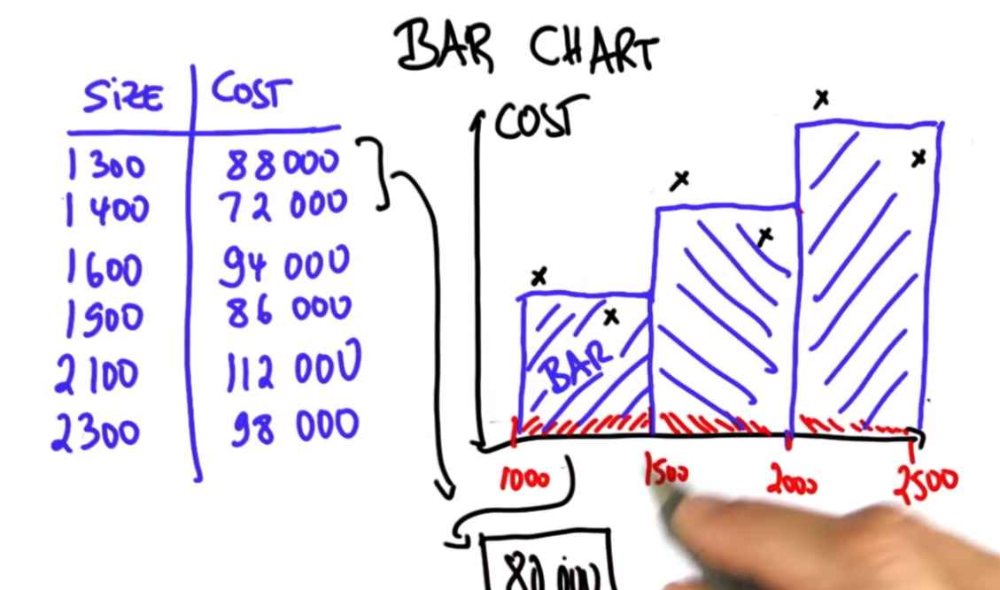

Bar chart is a common statistical data visualization tool.

The deviations from linear graph is called **"noise"**. Now, noise might not be the best term, but it's the term that statisticians use. 

In our case:

- It might be that one of them has a great view.
- The next one has an old house.
- One has coastal access, which makes it more expensive.
- One really requires a new kitchen.

There might be factors that really effect the house price beyond the size.
But if those factors are unincluded, to a statistician that's called **"random noise"**.
Let's talk about bar charts as one way to alleviate the problem.

In a bar chart, we take our raw data and pull it together. For example, we might say all the data that falls into interval should be summarized by a single value. Such a value would lie halfway in between two data points and form what's called a **bar**.

**What is the height in terms of the dollar figure for the very first bar?**  
It's the halfway point between 88,000 and 72,000, which is 80,000.

For two points that fall into the third bar. The mean value here is 105,000.

If you look at the bar graph, what you'll find is it's a much finer representation of the data.
By pooling together multiple data points into an individual bar, you can see that there is a much better way to really understand the dependence of cost to data. While the bar doesn't give you the linear relationship -  in fact, in this case, happens to be nonlinear - it really gives you a sense as you go up in house sizes the cost increases, which wasn't obvious from looking at the individual data points.

What the bar chart does is it really helps you to pool together groups of data into a single bar and understand **global trends**. Such global trends might not be that important if you only have six data points, but imagine you have 60,000. With 60,000 data points if you go look at this scatter plot, the individual data tells you very little, jumping in x parameter by a tiny bit might make a jump in y. Yet a bar graph can really help you understand the data. Clearly, one of the things that a statistician does is to use **cumulative tools**, such as bar graphs, to gain an understanding of the underlying data.

## Histogram

I want to talk briefly about histograms as a special case of a bar chart. The key difference is whereas the bar charts we discussed so far were defined over 2D data, the histograms look at 1D data. That is, there is only one dimension of data that is being plotted.

Let me start with an example. Here is a fictitious data set about annual income. Suppose at some company I asked software engineers how much annual income they make. Again, this data set is contrived. Of the nine people I asked, here is the survey of different annual salaries.

In the histogram case, I make a bar chart that concerns itself with only one thing, which is called **"frequency"**, which is short for **"count"**, that will group these salaries into three different buckets - from $120,000 on, $130,000 on, and $140,000 on.

What the bar chart plots is the frequency at which people asked fall into the different categories.

|Income|Frequency|
|------|---------|
|120000 - 130000|5|
|130000 - 140000|2|

Now, this histogram differs from the bar chart in that the vertical axis is just a frequency count whereas before it might have been a median home sales value. In 1-dimensional data sets that are numerical, this could be informative. You can say, for example the majority of workers in this company are in this salary bracket where as a much smaller number are in higher salary brackets.