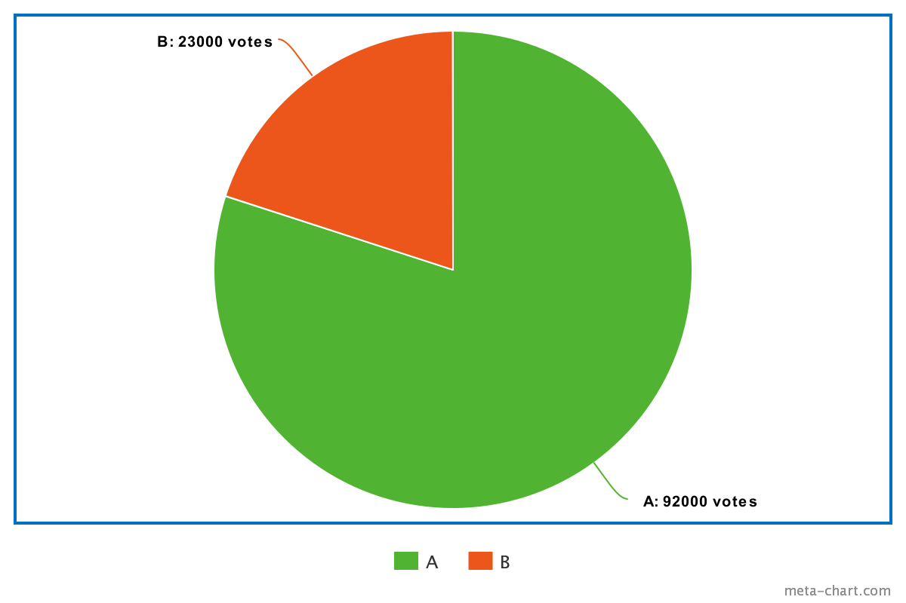
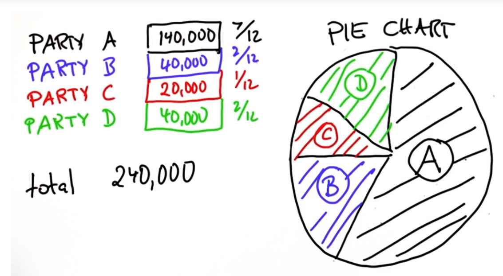

In statistics you use pie charts to visualize data, specifically relative data.

Now, I said that pie charts are good for relative data. To illustrate this, suppose party A got 724,000 votes
and party B got 181,000 votes.

**What is the percentage of votes that party A got?**
$$\frac{724,000}{724,000 + 181,000} = \frac{724,000}{905,000} = 0.8$$

**What's the percentage of votes for party B?**
$$\frac{181,000}{724,000 + 181,000} = \frac{181,000}{905,000} = 0.2$$

|Party|Votes|Percentage|
|-----|-----|----------|
|A|724,000|80|
|B|181,000|20|

### Relative Data

Given that we have a pie chart with distribution 80% and 20%, I'm now changing the total number of voter. I'm telling you there were 23,000 people voting for party B, and I'm asking you how many voted for party A such that the pie chart is exactly the correct one with an 80 to 20 distribution.

|Party|Votes|Percentage|
|-----|-----|----------|
|A|?|80|
|B|23,000|20|

$$\frac{23,000}{20} * 80 = 23000 * 4 = 92,000$$

What's remarkable about this chart is it's **invariant** to the total number of votes. What it really depicts is the relative number of votes. It shows that A got many, many more votes than B. It shows it graphically, so you can see this without even studying the numbers.

**Another Example:**

|Party|Votes|%|
|-----|-----|----------|
|A|175,000|7/12|
|B|50,000|2/12|
|C|25,000|1/12|
|D|50,000|2/12|

As a final question, I will now tell you that in a different election where the same pie chart is correct we had a total of 240,000 voters, which is the sum of all votes cast. Assuming that this pie chart here is correct, can you tell me how many votes are cast for each of the parties?

We know that 1/12 is 20,000.

- So A got 140,000, which is 7 times 20,000.  
- Party B got 2/12 or a 6th, which is 40,000.  
- Party C - a disappointing 20,000.  
- And party D the same as party B.

If we look at the diagram, it tell you nothing about the absolute numbers. In fact, I can change the absolute numbers. As long as the relative percentages stay the same, it does however tell you a lot about the distribution of the data. It shows you that A is the dominant party that got more than 50% of the outcome whereas B, C, and D occupies smaller slices with a slice for C being half the size of B or D, respectively.

Again, this is called a pie chart. Pie charts are really, really powerful to represent things like election outcomes.