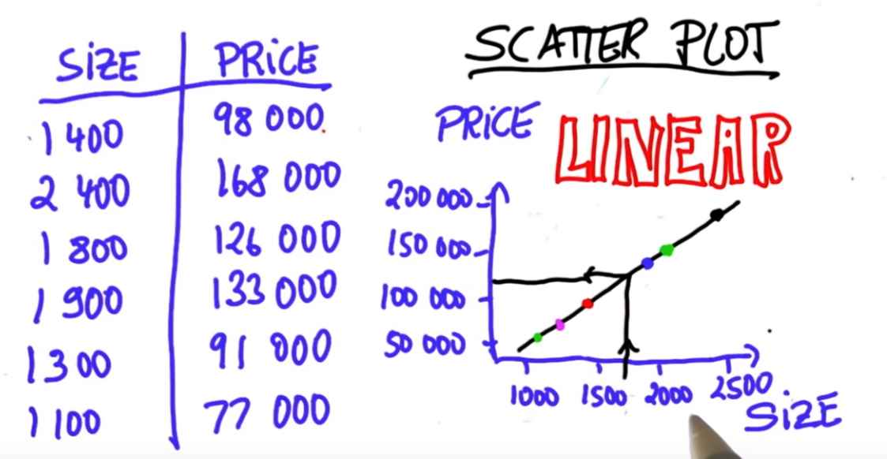
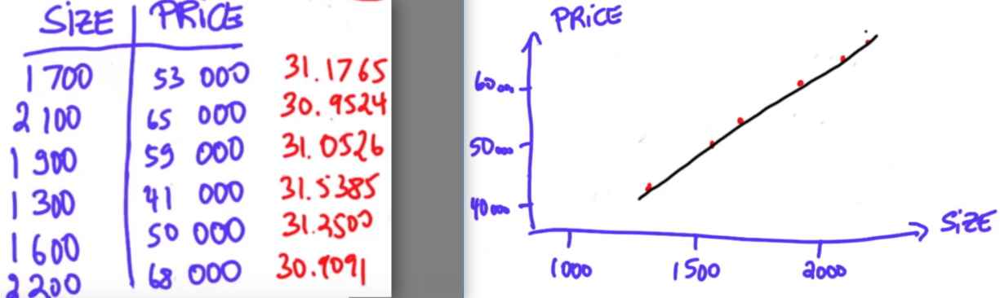

In a scatter plot, each data item becomes a point. We conveniently chose a 2-dimensional list to make for a 2-dimensional scatter plot. These are the most popular scatter plots because surfaces like paper are 2-dimensional. It's really hard to do it in like 125 dimensions.

Being as it is, when I draw in all the six data points, I get a scatter plot like this.

That's a nice scatter plot, because I can draw a line straight through all of the data points.
Now when this happens and there's a relationship that's governed by a straight line, we call the data **linear**. 

Now, linearity is a rare concept in statistics. Very often you'll find deviations, and that's because the size of the house is not the only determinant in the cost or perhaps because most of us are bad negotiators.

But when a data set is linear, it's really easy to predict prices of houses in between. For example, a house of this size ought to cost this much. You can read out of a scatter plot the dependence of the size of a house and its price. Here we are - we're actually looking at the data. We're doing what a statistician ought to do.

### Make Your OWN Scatter Plot
 

Even though there is not a fixed dollar price per square foot, the relationship is linear.
In this data, the prize is linear in the size plus or minus a constant dollar amount. Can you find this value?

The answer happens to be the square foot costs $30,
but there is a constant cost added of $2000.
If you plug this in, you'll find, for example, that 1700 times 30 gives $51,000,
but if you add the $2000, you'll correctly get $53,000.
Do it again with 2100 square feet over here multiplied by $30, add your $2000.
You get $65,000 and so on.